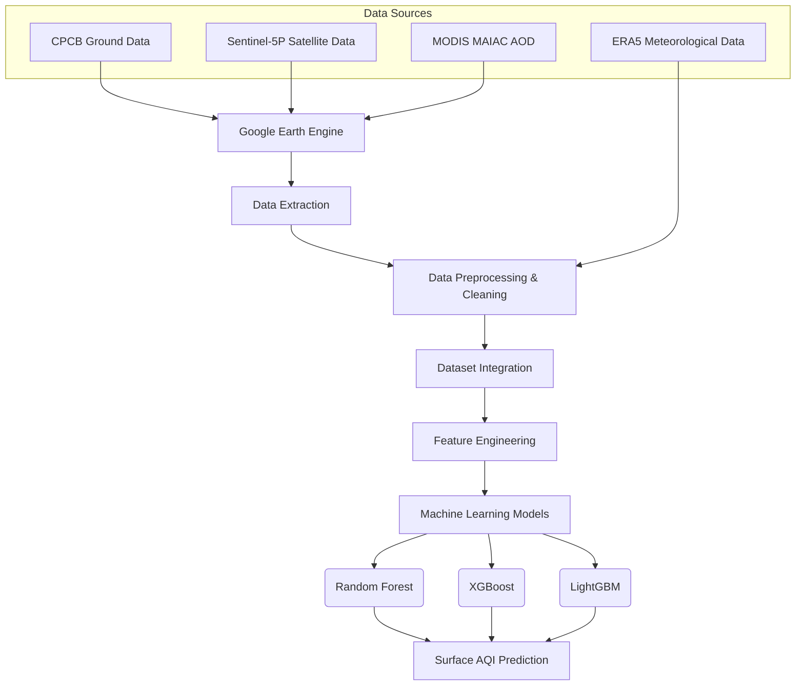

# 🌍 Surface AQI Prediction Using Satellite Data

> **A machine-learning framework for predicting Surface Air Quality Index (AQI) by integrating satellite, ground-based, and meteorological data.**

---

## 📌 Overview

Air pollution monitoring through conventional ground-based stations is limited by the number and geographical distribution of monitoring sites. Satellite observations provide much broader spatial coverage and can effectively bridge this gap.

This project combines ground monitoring observations from the CPCB with satellite-derived atmospheric information, Aerosol Optical Depth (AOD), and meteorological variables. The primary goal is to explore how satellite observations can complement conventional ground-based monitoring to build a scalable, data-driven framework for spatially comprehensive air-quality prediction.

## 🎯 Objectives

* **Develop** a machine-learning-based approach for surface AQI prediction.
* **Integrate** satellite observations with ground-based air-quality measurements.
* **Analyze** the relationship between satellite atmospheric observations and surface-level air quality.
* **Incorporate** meteorological conditions that influence pollutant concentration, dispersion, and transport.
* **Build** a scalable workflow to support air-quality monitoring beyond locations covered by physical ground stations.

---

## 🛰️ Data Sources

The project integrates multiple heterogeneous datasets to capture different aspects of atmospheric pollution:

| Data Source | Description | Purpose in Project |
| :--- | :--- | :--- |
| **CPCB Ground Data** | Ground-level air-quality observations from 43 working stations in Delhi. | Serves as the ground-truth reference data for surface air-quality analysis. |
| **Sentinel-5P / TROPOMI** | Satellite observations providing atmospheric pollutant information. | Provides wide spatial coverage; used as predictive features alongside ground data. |
| **MODIS MAIAC AOD** | Aerosol Optical Depth (AOD) data. | Represents atmospheric aerosol loading to establish relationships with surface particulate pollution. |
| **ERA5 Meteorology** | Meteorological variables (Temperature, Humidity, Wind conditions, Atmospheric pressure). | Accounts for atmospheric conditions that affect pollutant concentration, dispersion, and transport. |

---

## 🧠 Methodology & Pipeline

The major contribution of this project is the integration of these heterogeneous environmental datasets into a unified machine-learning workflow.

### Architecture



### 🔄 Data Processing Steps

1. **Ground Data Collection:** Consolidated daily observations from 43 CPCB monitoring stations. Standardized metadata (Name, Lat, Lon, Date) to associate with satellite data.
2. **Satellite Data Extraction:** Leveraged **Google Earth Engine (GEE)** to efficiently extract Sentinel-5P and MODIS data without manually downloading large files.
3. **Data Cleaning:** Standardized station names, corrected coordinates, handled missing values, aligned dates, and removed inconsistent records.
4. **Dataset Integration:** Combined ground measurements, satellite observations, AOD, meteorology, location, and date into a unified dataset providing a common feature space for ML models.

---

## 🤖 Machine Learning Models

Because Sentinel-5P measurements represent *atmospheric column information* rather than direct surface concentrations, they are used as predictive features alongside AOD and meteorological variables. Three tree-based machine-learning models were explored:

| Model | Role / Characteristics |
| --- | --- |
| **Random Forest** | Serves as a robust baseline for capturing nonlinear relationships. |
| **XGBoost** | Captures complex nonlinear relationships and intricate feature interactions. |
| **LightGBM** | Highly efficient gradient-boosting model optimized for structured tabular data. |

---

## 📊 Project Dataset Details

The final integrated dataset enables both temporal and spatial analysis of air quality. It contains observations characterized by:

* **Coverage:** 43 monitoring stations in Delhi.
* **Timeframe:** 365 days of consolidated observations.
* **Features:** Ground AQ measurements, Satellite observations, Aerosol Optical Depth, Meteorological variables, Station coordinates, and Date information.

---

## 🚀 Future Scope

* **High-Resolution Maps:** Generate and visualize high-resolution AQI prediction maps.
* **Geographical Expansion:** Scale the analysis from Delhi to larger regions and other major cities.
* **Deep Learning:** Explore advanced neural networks such as CNNs (for spatial features) or LSTMs (for temporal sequences).
* **Pollutant Transport:** Investigate dynamic pollutant transport using wind vectors and meteorological data.
* **Deployment:** Develop an interactive air-quality visualization dashboard and deploy the trained model as an online prediction service (API).

---

## 👨‍💻 Author

**Prerit Bhatia**

*A research-oriented data science project exploring the intersection of satellite remote sensing and machine learning for environmental monitoring.*


```
